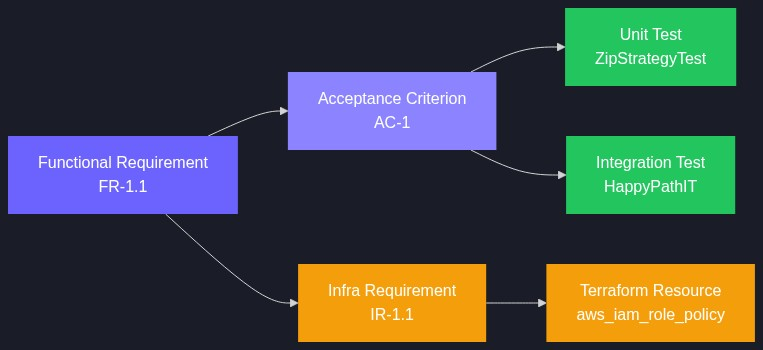
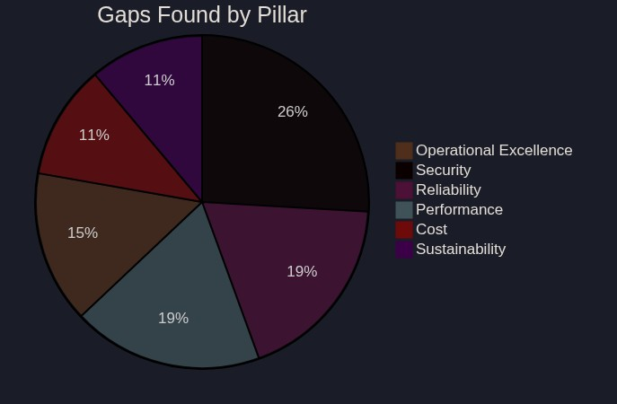
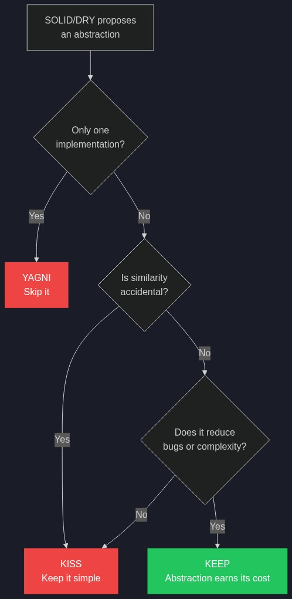
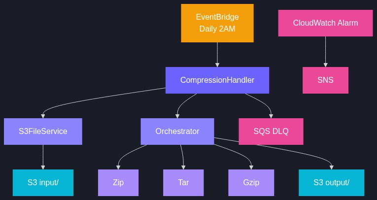
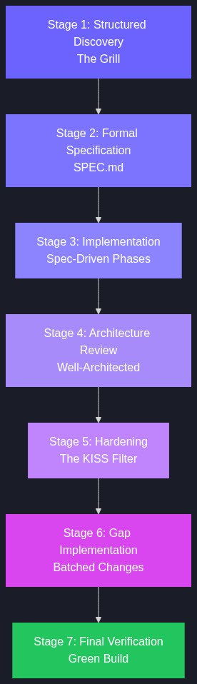

# From Three Bullets to Production: Spec-Driven Development with AI

*A practitioner's guide to using AI as a structured co-architect, not just a code generator.*

---

## The Premise

Most developers use AI assistants by pasting code and asking "fix this" or "write me a function." That works for small tasks. But for building production-grade systems — where security, reliability, and maintainability matter — you need a different approach.

This guide documents how we built a complete AWS Lambda project from a three-sentence idea to a production-ready, Well-Architected, fully tested system — using AI as a structured thinking partner at every phase. No code was written until the spec was locked.

**The project:** A Quarkus-based Lambda that reads files from S3, compresses them into .zip, .tar, and .gz formats, and uploads the results — triggered daily by EventBridge.

**The process:**

---

## Phase 1: The Raw Idea (5 minutes)

The journey started with three bullets:

> 1. Read some files from S3
> 2. Compress the files as 3 outputs — .zip, .gz and .tar
> 3. Host as a Lambda, triggered by scheduler
>
> "Let's discuss before jumping into development. Let's have a grill session. Ask me."

That last line is the key. Instead of letting the AI run off and generate code, we explicitly requested a **structured interrogation**. The AI is not a code monkey — it's a co-architect who must understand the problem before touching a keyboard.

> **Key Lesson:** Starting with "ask me" instead of "build me" fundamentally changes the AI's behavior. It shifts from solution mode to discovery mode, which is where the real value lies for non-trivial systems.

---

## Phase 2: The Interactive Grill (20 minutes)

The AI initially dumped 14 questions at once. We pushed back: *"Ask one by one."* This forced sequential, focused decision-making where each answer shaped the next question.

### The 12 Decisions That Shaped Everything

| # | Question Theme | Decision | Why It Mattered |
|---|---------------|----------|-----------------|
| 1 | How are files identified? | Everything under a configurable prefix | Drove the S3 listing strategy |
| 2 | Volume and size? | Small — under 50 MB | Justified in-memory processing |
| 3 | Single or multiple buckets? | Single bucket | Simplified IAM and config |
| 4 | What does ".gz" mean? | Raw gzip per file, NOT .tar.gz | Prevented a wrong assumption |
| 5 | One archive or per-file? | .zip + .tar (all) + individual .gz | Defined the strategy pattern |
| 6 | Output destination? | Same bucket, different prefix | Kept infrastructure simple |
| 7 | Schedule frequency? | Daily | Justified concurrency = 1 |
| 8 | Error handling? | Skip failed, compress rest, report | Defined partial failure model |
| 9 | Runtime mode? | GraalVM native image | Drove build tooling choices |
| 10 | Local testing tool? | Floci (not LocalStack) | AI had to look it up |
| 11 | Test data types? | Mixed (.txt, .csv, .json) | Shaped test data seeding |
| 12 | Notifications? | CloudWatch logs only | Simplified initial scope |

### Critical Moment: The AI Didn't Know Floci

When we said "Floci," the AI assumed we meant LocalStack or had a typo. We insisted. The AI searched, found floci.io, and adopted it — an MIT-licensed, Docker-based AWS emulator with no auth token required.

This moment illustrates an important dynamic: **the human brings domain knowledge the AI doesn't have.** The AI's job is to integrate that knowledge, not override it.

---

## Phase 3: The Formal Spec (15 minutes)

With all 12 decisions locked, the AI produced a formal **SPEC.md** — a traceable specification with unique IDs on every requirement.

The spec contained:

- **7 Functional Requirements** (FR-1 through FR-7) with traceable IDs
- **6 Non-Functional Requirements** (performance, runtime, config, observability, security, reliability)
- **6 Edge Cases** (empty prefix, all downloads fail, single file, special characters)
- **5 Acceptance Criteria** in Given/When/Then format
- **Interface definitions** with example JSON for success and partial-failure responses
- **Technology stack** with rationale for each choice
- **Infrastructure section** — 12 Terraform resources, 8 infra requirements
- **8 development phases** ordered by dependency

### Why Formal IDs Matter

Every requirement got an ID (FR-1.1, NFR-2.3, IR-1.6). This isn't bureaucracy — it's traceability. When we later found 27 gaps during the Well-Architected review, each gap could reference which spec item it affected. When a test fails, it maps back to an acceptance criterion, which maps back to a requirement.

### The Missing Section

During the spec phase, we noticed the AI had skipped infrastructure. We asked *"Why is it taking time?"* — a signal that the discussion was dragging without covering Terraform. The AI added Section 9 (Infrastructure) with resources, requirements, variables, outputs, and file structure — **all before a single line of code existed.**

---

## Phase 4: Implementation (30 minutes)

With the spec locked, coding was mechanical. The AI worked through 8 phases in order:

1. **Scaffold** — pom.xml, docker-compose (Floci), seed script
2. **Models & Config** — Java records (`FileEntry`, `CompressionResult`), `CompressorConfig`
3. **Compression Strategies** — Three classes implementing `CompressionStrategy` + 14 unit tests
4. **S3 Service** — List/download/upload with paginated listing, virtual threads, error handling
5. **Orchestrator & Handler** — Sealed `StrategyOutcome`, pattern matching, builder, timeout awareness
6. **Integration Tests** — 3 full-flow tests against Floci
7. **Terraform** — S3, Lambda (arm64), IAM, EventBridge, CloudWatch, DLQ, Alarms
8. **Build verification** — 17 tests passing

The spec acted as a checklist. Each phase referenced specific spec sections (e.g., "Implement FR-1, FR-2, FR-6"). There was no ambiguity about what to build or what "done" meant.

---

## Phase 5: The Well-Architected Review (30 minutes)

This is where spec-driven development pays compound interest. Instead of reviewing code line-by-line, we reviewed the **system** through the AWS Well-Architected Framework's six pillars.

### Pillar-by-Pillar Findings

| Pillar | Gaps Found | Example |
|--------|-----------|---------|
| **Operational Excellence** | No alarms, no DLQ, no runbook | Failed invocations vanish silently |
| **Security** | No S3 encryption, credentials undocumented, no Zip Slip protection | Static creds in config without context |
| **Reliability** | No S3 pagination, no memory guard, strategy failures swallowed | Listing breaks at 1001 files |
| **Performance** | Sequential downloads, no arm64, no buffer pre-sizing | Virtual threads would parallelize I/O |
| **Cost** | No lifecycle policy on outputs, no right-sizing | Old compressed files accumulate forever |
| **Sustainability** | No Graviton, no data lifecycle | x86 when arm64 is cheaper and faster |

We catalogued **30 potential improvements**, debated each, and implemented **27** (3 were cancelled during KISS review). Each gap was tracked with a source (which pillar or principle surfaced it) and a specific fix.

---

## Phase 6: The KISS Filter (10 minutes)

The most valuable 10 minutes. After identifying improvements through SOLID/DRY principles, we applied a **KISS filter** — a second pass that asked "is this abstraction earning its keep?"

### Three Abstractions Rejected

| Proposal | Why Rejected |
|----------|-------------|
| `FileStorageService` interface | **YAGNI** — only one storage backend. An interface adds indirection with zero benefit. |
| `AbstractArchiveStrategy` base class | **Accidental similarity** — Zip, Tar, and Gzip differ enough that a shared base adds complexity without reducing bugs. |
| Inject interface instead of concrete class | Same as above — follows from rejecting the interface. |

### Two Abstractions Kept

| Proposal | Why Kept |
|----------|---------|
| `CompressionResult` builder | 7+ fields with new `strategyFailures`. Factory methods become unwieldy. Builder auto-derives status. |
| `TestDecompressor` utility | Clear DRY win — identical decompress logic duplicated across 4 test classes. |

> **The Principle:** DRY is about knowledge duplication, not code duplication. Three strategies that happen to write bytes to a stream aren't duplicating knowledge — they're independently implementing different compression algorithms. Forcing them into a base class conflates accidental similarity with genuine duplication.

---

## Phase 7: Java 21 & Quarkus Upgrade (5 minutes)

We evaluated modern Java features against the KISS bar:

| Feature | Adopted? | Rationale |
|---------|----------|-----------|
| **Virtual threads** | Yes | Parallel S3 downloads — I/O-bound, perfect fit |
| **Sealed interfaces** | Yes | `StrategyOutcome` (Success/Failure) — compiler enforces exhaustive handling |
| **Pattern matching switch** | Yes | Content-type mapping — cleaner than if/else chain |
| **Record patterns** | No | Marginal benefit in this codebase |
| **Unnamed `_` in catch** | No | Preview feature — risky for native image |
| **Pre-sized buffers** | Yes | Minor perf win, trivial to implement |

Quarkus was upgraded from **3.17.7** (EOL, no security patches) to **3.33.2 LTS** (supported until March 2027). We chose LTS over bleeding-edge 3.37 because production stability matters more than new features.

---

## System Architecture

---

## The Execution Plan: Idea to Production

Here's the reusable 7-stage playbook, distilled from this experience:

### Stage 1: Structured Discovery (The Grill)
1. State your idea in 3–5 bullets
2. Tell the AI: **"Don't build. Ask me questions one at a time."**
3. Answer each question — decisions compound
4. Lock in: scope, volume, error strategy, runtime, infrastructure, testing tools

### Stage 2: Formal Specification
1. AI produces SPEC.md with traceable IDs (FR-x.x, NFR-x.x, IR-x.x)
2. Review for completeness: functional, non-functional, edge cases, interfaces, test plan
3. Add infrastructure section (Terraform/CDK/SAM) — **don't defer this**
4. Add acceptance criteria in Given/When/Then
5. Review and sign off before any code

### Stage 3: Implementation (Spec-Driven)
1. Work through phases in dependency order
2. Reference spec sections in each phase
3. Write tests alongside code, not after
4. Use local emulation (Floci, LocalStack) for integration tests
5. All tests must pass before proceeding

### Stage 4: Architecture Review
1. Walk through each Well-Architected pillar — don't skip any
2. Catalogue every gap with a specific fix
3. Track items in a numbered gap list with source

### Stage 5: Hardening (The KISS Filter)
1. Review each proposed improvement through KISS lens
2. Cancel abstractions that don't earn their complexity
3. Keep changes that solve real problems
4. Apply modern language features only where they genuinely simplify

### Stage 6: Gap Implementation
1. Batch related changes (spec, code, config, Terraform, tests)
2. Run full test suite after each batch
3. Verify green build before declaring done

### Stage 7: Final Verification
1. All tests pass
2. Spec matches implementation
3. Infrastructure matches spec
4. No known gaps remain

---

## 10 Critical Decision Notes

These are the non-obvious decisions that shaped the project. Keep these in mind for your next build:

1. **"Ask me" > "Build me"** — Starting with discovery instead of generation produces better systems. The AI finds edge cases you wouldn't think of and forces you to make decisions explicitly.

2. **One question at a time** — Batch questions let you skip hard ones. Sequential questions force commitment at each step. This produces a cleaner spec.

3. **The spec is the contract** — Every test maps to an acceptance criterion, which maps to a requirement. When something breaks, you trace back to the spec, not to "I think it should work this way."

4. **Infrastructure belongs in the spec** — Terraform/CDK/SAM resources are part of the system. Deferring them creates a gap between what the code assumes and what actually exists.

5. **Well-Architected review after first build** — Don't review an empty spec. Build the v1, then stress-test it through each pillar. The gaps are more concrete when you have real code.

6. **The KISS filter is mandatory** — SOLID and DRY will generate proposals for abstractions. Run every proposal through "does this abstraction earn its keep?" Most won't. That's fine.

7. **LTS over latest** — For production, choose the long-term support version. Bleeding-edge frameworks break in native image builds and have untested edge cases. 3.33 LTS > 3.37 latest.

8. **Static credentials are a code smell** — Even for local dev, document clearly that credentials are throwaway Floci-only values. Explicit is always better than implicit.

9. **Reserved concurrency for batch jobs** — A daily Lambda doesn't need 1000 concurrent instances. `reserved_concurrent_executions = 1` prevents runaway scaling from misconfigured cron or manual re-invokes.

10. **Sealed types for outcomes** — When a function can succeed or fail, model that as a sealed interface. The compiler enforces exhaustive handling — no silent swallowing of errors.

---

## What We Built

| Metric | Value |
|--------|-------|
| Lines of spec | ~400 (SPEC.md v2.0) |
| Java source files | 11 |
| Test files | 5 (including shared TestDecompressor) |
| Terraform files | 7 |
| Tests | 17 (all passing) |
| Well-Architected gaps found | 30 |
| Gaps implemented | 27 |
| Gaps cancelled (KISS) | 3 |
| Quarkus version | 3.33.2 LTS |
| Java version | 21 |
| Architecture | arm64 (Graviton) |
| Time: idea to green build | ~2 hours |

---

## Conclusion

Spec-driven development with AI isn't about making the AI write more code faster. It's about making the AI **think with you** before either of you writes anything. The spec becomes the single source of truth. The AI becomes a structured interviewer, a gap finder, and an implementation engine — in that order.

> The next time you have an idea, don't start with "build me X." Start with **"let's discuss X. Grill me."**
